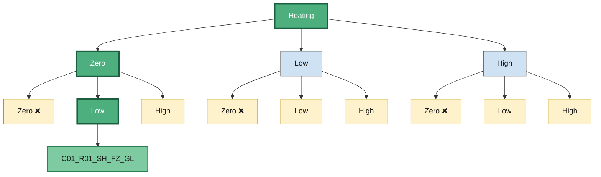

[](https://github.com/ibarram/thermal-fluid-predictor/)
[](https://github.com/ibarram/thermal-fluid-predictor/)
[](https://github.com/ibarram/thermal-fluid-predictor/discussions)
[](https://github.com/ibarram/thermal-fluid-predictor/issues)
[](README_ES.md)
[](https://creativecommons.org/licenses/by/4.0/)
[](https://opensource.org/licenses/MIT)

<br />
<div align="center">
  <a href="https://github.com/ibarram/thermal-fluid-predictor">
    
  </a>

  <h3 align="center">thermal-fluid-predictor</h3>

  <p align="center">
    Experimental dataset and multi-language implementation for real-time fluid temperature prediction in gas-based water heaters using embedded systems.
    <br />
    <a href="https://github.com/ibarram/thermal-fluid-predictor"><strong>Explore the docs »</strong></a>
    <br />
    <br />
    <a href="https://github.com/ibarram/thermal-fluid-predictor/issues">Report Bug</a>
    ·
    <a href="https://github.com/ibarram/thermal-fluid-predictor/issues">Request Feature</a>
  </p>
</div>

<details><summary>Table of Contents</summary><p>

 * [Abstract](#abstract)

 * [Testbench](#testbench)

 * [Get the data](#get-the-data)

 * [Database](#database)

 * [Loading data](#loading-data)

 * [Implementations](#implementations)

 * [Benchmark](#benchmark)

 * [Publications](#publications)

 * [Contact](#contact)

 * [Citing thermal-fluid-predictor database](#citing-thermal-fluid-predictor-database)

 * [License](#license)

</p></details><p></p>

## Abstract

Thermal Fluid Predictor is a cross-platform project for modeling and predicting fluid temperature behavior in real-time. The repository includes implementations in Python, MATLAB, C, and R, tailored for integration into energy-constrained embedded systems such as gas water heaters. It provides curated datasets, trained models, and system diagrams to support reproducible development, simulation, and deployment.

The dataset contains measurements of five variables obtained from the Rapid Recovery Water Heater. The sampling methodology is based on the **"water state process."**

Each process has a total sampling duration of 4 minutes.

Samples are recorded every 200 *ms*, that is, at a sampling frequency of 5 *Hz*, which means that in each 4-minute phase we have 1,200 samples.

The construction of the data files was based on the following `Table 1`, which includes 12 unique, non-repeating combinations.

| # | File Name | Rep. | Water State | Water Flow | Gas Flow | Inlet Temp. (°C) | Set Temp. (°C) |
|:-:|:-|:-:|:-|:-|:-|:-:|:-:|
| 1 | `C01_R01_SH_FZ_GL` | 1 | Heating | Zero | Low | 27 | — |
| 2 | `C02_R01_SH_FZ_GH` | 1 | Heating | Zero | High | 32 | — |
| 3 | `C03_R01_SH_FL_GL` | 1 | Heating | Low | Low | 26 | — |
| 4 | `C04_R01_SH_FL_GH` | 1 | Heating | Low | High | 28 | — |
| 5 | `C05_R01_SH_FH_GL` | 1 | Heating | High | Low | 25 | — |
| 6 | `C06_R01_SH_FH_GH` | 1 | Heating | High | High | 25 | — |
| 7 | `C07_R01_SS_FL_GL` | 1 | Steady | Low | Low | — | 41 |
| 8 | `C08_R01_SS_FL_GH` | 1 | Steady | Low | High | — | 40 |
| 9 | `C09_R01_SS_FH_GL` | 1 | Steady | High | Low | — | 38 |
| 10 | `C10_R01_SS_FH_GH` | 1 | Steady | High | High | — | 35 |
| 11 | `C11_R01_SC_FL_GZ` | 1 | Cooling | Low | Zero | — | — |
| 12 | `C12_R01_SC_FH_GZ` | 1 | Cooling | High | Zero | — | — |

**Table 1.** *Combinations used to generate the data files. Each combination was repeated 10 times, yielding 120 records in total. Inlet temperature applies only to the Heating state; set temperature only to the Steady state.*

Therefore, the total number of data files is 12 unique files. But we have repetitions files to generate more dataset information, 10 files per process, resulting in a total of 120 files.

## Testbench

The dataset was acquired in the Laboratory of Electrical Engineering, Division of Engineering at Irapuato-Salamanca Campus of the University of Guanajuato, Mexico.

The testbench consists of a Rapid Recovery Water Heater System that operates with LP gas and supplies 13 liters of water per minute. It is powered by two 1.5 V D-cell batteries connected in series (3 V total) and includes a servo valve to control the LP gas supply.

<div align="center">
  <a href="https://github.com/ibarram/thermal-fluid-predictor">
    
  </a>

**Figure 1.** *Above is a photograph of the test bench used to generate the database. This setup provides a visual representation of our data collection process. **Left View of System** | **Front View of System** | **Right View of System**.*
</div>

The electrical signals from the sensors mounted on the heating system are processed using two devices. The first is the STM32L476RGT6 microcontroller, integrated on a Nucleo Board, which receives signals from two temperature sensors (NTC Thermistor 3950 MF52 100K ohm 1%) to measure voltage variations caused by changes in the sensor's resistance when exposed to temperature. Each of these two sensors is externally mounted on the inlet and outlet water pipes, respectively.

It also collects water flow data using a Hall-effect sensor (YF-B1 flow sensor), which measures the pulses per second (Hz) generated by the flow of water through the pipe.

The second device is the NI USB-TC01 module, which enables the measurement of the outlet temperature using a precision Type K thermocouple probe.

As mentioned earlier, the data acquisition is structured based on the "water process" concept to generate the corresponding files. The naming convention for the files follows this structure: **C"XX"_R"ZZ"_S"W"_F"Y"_G"V"**, which will be explained in detail in each of the following images.

As initially shown in `Figure 2`, the first part of the filename indicates the file number and its repetition (**C"XX"_R"ZZ"**). In total, there are 12 unique files, each of which was replicated 10 times for this dataset. However, additional repetitions can be generated if needed.

<div align="center">
  <a href="https://github.com/ibarram/thermal-fluid-predictor">
    
  </a>

**Figure 2.** *Obtain Combination number and Repetition number.*
</div>

In the second step, as shown in `Figure 3`, the "water process" is assigned (**S"W"**):

- Water is being heated (**SH – State Heating**).
- Water temperature is being maintained at a set point (**SS – State Steady**).
- Water is being cooled down (**SC – State Cooling**).

For each case, the sampling duration is 4 minutes with one sample taken every 200 *ms*, corresponding to a sampling frequency of 5 *Hz* and a total of 1,200 samples per full cycle.

In the first case (SH), water is actively heated, so both the LP gas output and the ignition spark are activated to produce a flame.
In the second case (SS), a SET temperature is defined and a basic control method is applied, which simply turns the gas source on and off to maintain a relatively stable (though not precisely controlled) temperature, only for experimental purposes.
In the final case (SC), the system enters the cooling phase, where both the LP gas output and ignition spark are turned off so that the flame is no longer produced.

<div align="center">
  <a href="https://github.com/ibarram/thermal-fluid-predictor">
    
  </a>

**Figure 3.** *Obtain Water Temperature State*
</div>

In the third step, shown in `Figure 4`, the water flow rate circulating through the pipe is assigned (**F"Y"**).
This variable does not have a fixed value—it entirely depends on the water consumption or demand from the user. Therefore, only estimated values were defined by our research team:

- Water Flow "Zero" (**FZ**): Flow rate should be zero, meaning the outlet valve of the water heater is completely closed, while the inlet valve remains open.
- Water Flow "Low" (**FL**): Flow rate is between 4–7 *L/min*. Both the inlet and outlet valves are open. For this experiment, the outlet valve was set at a halfway position.
- Water Flow "High" (**FH**): Flow rate is between 12–15 *L/min*. Both the inlet and outlet valves are open. For this experiment, the outlet valve was fully opened.

<div align="center">
  <a href="https://github.com/ibarram/thermal-fluid-predictor">
    
  </a>

**Figure 4.** *Obtain Water Flow.*
</div>

In the final step, shown in `Figure 5`, the output value for the LP gas valve opening is assigned (**G"V"**).
This variable is not measured in terms of pressure, but rather by the amount of electrical current supplied to the solenoid valve to control its opening. This behavior is illustrated in `Figure 6`, which shows the functional characteristic curve. The valve operation is defined as follows:

- Gas Flow "Zero" (**GZ**): Applied current = 0 *mA*; the valve remains fully closed.
- Gas Flow "Low" (**GL**): Applied current = 10 *mA*; the valve opens to a minimal position.
- Gas Flow "High" (**GH**): Applied current = 25 *mA*; the valve opens to its maximum position. Applying more current does not produce further changes.

<div align="center">
  <a href="https://github.com/ibarram/thermal-fluid-predictor">
    
  </a>

**Figure 5.** *Obtain Gas Flow.*
</div>


<div align="center">
  <a href="https://github.com/ibarram/thermal-fluid-predictor">
    
  </a>

**Figure 6.** *Electrovalve Characteristics.*
</div>

For example to generate a file. We will need to assign the following parameters using `Table 1` as a reference:

- **C01_R01**: First Sample then *C01*, and first repetition then *R01*.
- **SH**: The water will begin heating, so we select the Heating option in State of the interface.
- **FZ**: The water flow will be zero for our first case; therefore, the outlet valve will remain closed, and we set the Water Flow to Zero in the interface.
- **GL**: The LP gas flow will be low, so we select the Low option in Gas Flow of the interface.

The final file name will be: **`C01_R01_SH_FZ_GL`**

***Note:*** Some considerations must be taken into account in certain cases. For example, as shown in `Figure 7`, some elements in the "Gas Flow" section—such as the Zero condition—are crossed out, this is because water cannot be heated if there is no gas flow; therefore, it makes no sense to consider that option.



**Figure 7.** *Example, how to select variables for each file part.*

In this way, the 12 essential files of our process will be generated. Each file contains a total of 1,200 samples. That is, we will have 12 csv files, each with dimensions [1200x5], giving us a total of [12x1200x5]. If we consider that 10 repetitions are generated for each file, we will have [12x10] csv files. Combining this with the number of samples per file results in [12x10x1200x5] = [144,000x5] total samples.

If you need to use the LabVIEW interface along with the code used to load it onto the STM32 board, the download links are attached.

<div align="center">
  <a href="https://github.com/ibarram/thermal-fluid-predictor">
    
  </a>

**Figure 8.** *Example view of interface from Labview.*
</div>

You can download the interface of Labview with the next link.

|Name|Description|Size|Link|
|:-|:-|:-|:-|
| `Data_HeaterSystem.zip` | Labview interface to generate the database  | 288 KBytes | [Download](src/Data_HeaterSystem.zip) |

<div align="center">
  <a href="https://github.com/ibarram/thermal-fluid-predictor">
    
  </a>

**Figure 9.** *Platform of [STM32CubeIDE](https://www.st.com/en/development-tools/stm32cubeide.html#overview).*
</div>


|Name|Description|Size|Link|
|:-|:-|:-|:-|
| `STM32_Code_tfp.zip` | STM32 Code  | 14.7 MBytes | [Download](src/STM32_Code_tfp.zip) |

## Get the Data

You can use direct links to download the dataset. The data is stored in the csv and mat formats.

|Name|Description|Samples|Size|Link|MD5 Checksum|
|:-|:-|:-|:-|:-|:-|
| `Raw_Signals_tfp.zip` | Raw data in CSV format | [144,000x5] | 1.2 MBytes | [Download](Dataset/Raw_Signals_tfp.zip) | *(pending)* |
| `Raw_Signals_tfp_Folders.zip` | Raw data in CSV format arranged in folders | [144,000x5] | 1.21 MBytes | [Download](Dataset/Raw_Signals_tfp_Folders.zip) | *(pending)* |
| `data_tfp.mat` | Raw data in mat format | [144,000x5] | 1.94 MBytes | [Download](Dataset/data_tfp.mat) | *(pending)* |

> Checksums can be verified with `md5sum <file>` on Linux/macOS or `CertUtil -hashfile <file> MD5` on Windows.

Alternatively, you can clone this GitHub repository; the dataset appears under `Dataset/`. This repository also contains some scripts for load and visualization.

### Recorded variables

| Column | Variable | Unit | Description |
|:-|:-|:-|:-|
| 1 | `Time` | s | Elapsed time since the beginning of the record |
| 2 | `TempIn` | °C | Inlet water temperature (NTC thermistor, non-invasive) |
| 3 | `TempOut` | °C | Outlet water temperature (NTC thermistor, non-invasive) |
| 4 | `WaterFlow` | L/min | Outlet water flow (Hall-effect sensor) |
| 5 | `TempReal` | °C | Reference outlet temperature (Type K immersion thermocouple) |

## Database

The database is presented in two formats. The first format uses MATLAB software, providing one `.mat` file referring to the thermal-fluid-predictor. The organization of the `.mat` file is illustrated in `Figure 10`, where the values and number of samples change depending on which file is selected.

<div align="center">
  <a href="https://github.com/ibarram/thermal-fluid-predictor">
    
  </a>

**Figure 10.** *Schematic representation of the data organized for MATLAB file.*
</div>

The second format is a set of CSV files organized into folders, one folder per operating state, available in `Raw_Signals_tfp_Folders.zip`. Each folder includes the acquired measurements in individual files following the naming convention described above.

In addition to the dataset, scripts to load and read the data are provided for MATLAB, Python, R, and C.

## Loading data

Multiple scripts were created to efficiently load the dataset. These scripts facilitate the loading of both raw and processed data, enabling work at different stages of analysis. The scripts have been developed in MATLAB, Python, R, and C.

#### MATLAB

```matlab
% Load the full dataset
load('Dataset/data_tfp.mat');

% Load a single record
T = readtable('Dataset/Raw_Signals_tfp/C01_R01_SH_FZ_GL.csv');

plot(T.Time, [T.TempIn, T.TempOut, T.TempReal]);
xlabel('Time (s)'); ylabel('Temperature (\circC)');
legend('TempIn','TempOut','TempReal');
```

#### Python

```python
import pandas as pd
import matplotlib.pyplot as plt

df = pd.read_csv('Dataset/Raw_Signals_tfp/C01_R01_SH_FZ_GL.csv')

df.plot(x='Time', y=['TempIn', 'TempOut', 'TempReal'])
plt.xlabel('Time (s)')
plt.ylabel('Temperature (°C)')
plt.show()
```

#### R

```r
df <- read.csv("Dataset/Raw_Signals_tfp/C01_R01_SH_FZ_GL.csv")

matplot(df$Time, df[, c("TempIn", "TempOut", "TempReal")],
        type = "l", lty = 1,
        xlab = "Time (s)", ylab = "Temperature (C)")
legend("topleft", c("TempIn", "TempOut", "TempReal"),
       lty = 1, col = 1:3)
```

#### C

```c
#include <stdio.h>

int main(void) {
    FILE *f = fopen("Dataset/Raw_Signals_tfp/C01_R01_SH_FZ_GL.csv", "r");
    char line[256];
    float t, tin, tout, flow, treal;

    fgets(line, sizeof(line), f);            /* skip header */
    while (fgets(line, sizeof(line), f)) {
        sscanf(line, "%f,%f,%f,%f,%f", &t, &tin, &tout, &flow, &treal);
        printf("%6.2f  %6.2f\n", t, treal);
    }
    fclose(f);
    return 0;
}
```

<div align="center">
  <a href="https://github.com/ibarram/thermal-fluid-predictor">
    
  </a>

  <a href="https://github.com/ibarram/thermal-fluid-predictor">
    
  </a>

  <a href="https://github.com/ibarram/thermal-fluid-predictor">
    
  </a>

**Figure 11.** *Samples of Heating Water | Steady Water | Cooling Water.*
</div>

## Implementations

The `models/` directory contains the scripts used to train and evaluate the soft-sensor models reported in the associated publication.

| Path | Description |
|:-|:-|
| `models/train_knn.m` | Distance-weighted KNN regression, one model per operating state |
| `models/train_dl.m` | LSTM, GRU, and Bi-LSTM baselines |
| `models/group_kfold.m` | Record-level 5-fold partitioning |
| `models/ema_filter.m` | First-order exponential moving average filter |

> **Validation protocol.** Cross-validation folds are formed at the **record level**, not at the sample level: the 120 acquisition files are split into five disjoint groups, so that all 1,200 samples of a given record belong exclusively to either the training or the validation partition. This prevents temporally adjacent samples (200 ms apart, and therefore strongly correlated) from appearing in both partitions, which would otherwise bias local estimators such as KNN. All reported metrics are computed on held-out validation records.

## Benchmark

Feel free to submit your benchmark by creating a new issue, and we'll display your results here. Before proceeding, ensure your benchmark doesn't already exist on this list. For further information, refer to our contributor guidelines.

| Model | State | MAE (°C) | RMSE (°C) | R² | Within ±1 °C (%) | Source |
|:-|:-|:-|:-|:-|:-|:-|
| KNN (weighted) | Heating | 0.231 | 0.752 | 0.947 | 93.70 | This work |
| KNN (weighted) | Steady | 0.093 | 0.233 | 0.994 | 99.10 | This work |
| KNN (weighted) | Cooling | 0.144 | 0.321 | 0.996 | 97.14 | This work |
| KNN (weighted) | All States | 0.273 | 0.842 | 0.970 | 92.65 | This work |

## Publications

Publications from the scientific community that use the TFP dataset:

*A journal article describing this dataset is currently under review. This list will be updated upon acceptance.*

## Contact

[Dr. M.-A. Ibarra-Manzano](mailto:ibarram@ugto.mx?subject=[GitHub]%20TFP%20dataset) - [ORCID: 0000-0003-4317-0248](https://orcid.org/0000-0003-4317-0248) - [SCOPUS: 15837259000](https://www.scopus.com/authid/detail.uri?authorId=15837259000)

[M.I. M.-A. Armenta-Loredo](mailto:ma.armentaloredo@ugto.mx?subject=[GitHub]%20TFP%20dataset) - [ORCID: 0009-0006-7338-6065](https://orcid.org/0009-0006-7338-6065)

Project Link: [thermal-fluid-predictor (TFP)](https://github.com/ibarram/thermal-fluid-predictor)

## Citing thermal-fluid-predictor database

If you use the TFP database in a scientific publication, we would appreciate references to the following work. A journal article is currently under review; citation details will be added upon acceptance. In the meantime, please cite the repository:

BibTeX entry:

```bibtex
@misc{tfp2026,
  author    = {Ibarra-Manzano, Mario-Alberto and
               Armenta-Loredo, Miguel-Angel and
               Almanza-Ojeda, Dora-Luz},
  title     = {Thermal Fluid Predictor {(TFP)} Dataset},
  year      = {2026},
  publisher = {Zenodo},
  doi       = {10.5281/zenodo.XXXXXXX},
  url       = {https://github.com/ibarram/thermal-fluid-predictor}
}
```

Biblatex entry:

```bibtex
@dataset{tfp2026,
  author    = {Ibarra-Manzano, Mario-Alberto and
               Armenta-Loredo, Miguel-Angel and
               Almanza-Ojeda, Dora-Luz},
  title     = {Thermal Fluid Predictor {(TFP)} Dataset},
  date      = {2026},
  publisher = {Zenodo},
  doi       = {10.5281/zenodo.XXXXXXX},
  url       = {https://github.com/ibarram/thermal-fluid-predictor},
  version   = {1.0.0}
}
```

## License

This repository uses two licenses:

- **Dataset** (`Dataset/`): [Creative Commons Attribution 4.0 International (CC BY 4.0)](https://creativecommons.org/licenses/by/4.0/). You are free to share and adapt the data for any purpose, provided appropriate credit is given.
- **Source code** (`src/`, `models/`, loading scripts): [MIT License](https://opensource.org/licenses/MIT).

See [`LICENSE`](LICENSE) and [`LICENSE-DATA`](LICENSE-DATA) for the full terms.
